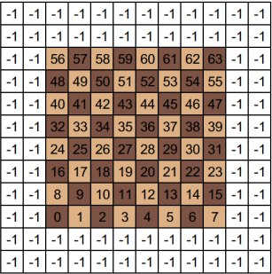
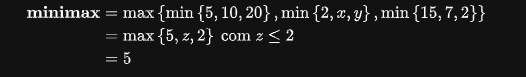
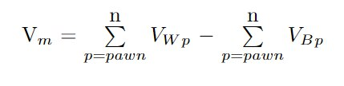
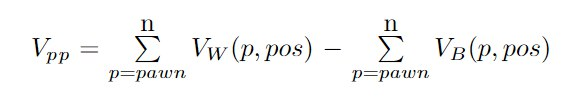
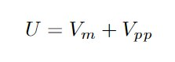

## Especificações Ténicas

Nesse projeto, foi construído um motor de xadrez simples para terminal
escrito 100% em `Typescript` no `NodeJS` utilizando
o gerenciador de pacotes e dependências `Yarn`.

### Dependecias

> - ```npm install prompt-sync```
>
> - ```npm i --save-dev @types/node ```
> 
> - ```npm install --global yarn```

### Como Executar

Para iniciar uma partida do xadrez, digite ```yarn dev``` no terminal.

## Caraterísticas do Motor de Xadrez
### Representação de Tabuleiro



A representação é feita através de uma matriz 12 × 12. Esta representação adiciona
duas linhas e duas colunas nas bordas do tabuleiro 8 × 8. Esta borda, que representa as casas fora do
tabuleiro, é necessária para verificar se o movimento é válido. Duas colunas ou linhas, em vez de uma, são
necessárias para garantir a verificação do movimento do cavalo. Na fase de geração do movimento, se o
destino de uma peça for uma casa na borda, o movimento é desconsiderado [[1]](https://bcc.ime.usp.br/tccs/2014/hvmds/Monografia.pdf).


### Algoritmo de busca 

#### Poda Alfa-Beta
A poda alfa-beta (ou poda α-β) é uma variação do algoritmo 
minimax que visa reduzir o número de nós que são avaliados 
na árvore de busca. É uma busca adversarista comumente utilizada
na implementação de jogadores automáticos em jogos com 
dois jogadores (Jogo da Velha, Xadrez, Go, etc.).

O algoritmo mantém dois valores, alpha e beta, os quais
representam a pontuação máxima que é garantida ao jogador
maximizador (max) e a pontuação mínima que é garantida ao 
jogador minimizador (min), respectivamente. Inicialmente, alpha 
recebe o valor "infinito negativo" e beta, "infinito positivo".

O exemplo abaixo demonstra, de uma forma simples, o princípio matemático presente no funcionamento da poda α-β.



Note que, independente do valor de `x` e `y` o resultado da equação é o mesmo [[2]](https://pt.wikipedia.org/wiki/Poda_(computa%C3%A7%C3%A3o)).
##### Pseudocódigo
```ts 
function minimax(node, depth, isMaximizingPlayer, alpha, beta):

    if node is a leaf node :
        return value of the node
    
    if isMaximizingPlayer :
        bestVal = -INFINITY 
        for each child node :
            value = minimax(node, depth+1, false, alpha, beta)
            bestVal = max( bestVal, value) 
            alpha = max( alpha, bestVal)
            if beta <= alpha:
                break
        return bestVal

    else :
        bestVal = +INFINITY 
        for each child node :
            value = minimax(node, depth+1, true, alpha, beta)
            bestVal = min( bestVal, value) 
            beta = min( beta, bestVal)
            if beta <= alpha:
                break
        return bestVal
```

Nesse projeto, o motor de xadrez foi definido como `MIN` e o jogador humano como `MAX`. Além disso,
foi utilizado uma profundidade de 3 nivéis para a expansão da árvore de escolha do algoritmo.

### Função Heurística
Uma função heurística, também chamada simplesmente de heurística, 
é uma função que classifica alternativas em algoritmos de pesquisa
em cada etapa de ramificação com base nas informações disponíveis 
para decidir qual ramificação seguir [[3]](https://pt.wikipedia.org/wiki/Heur%C3%ADstica_(computa%C3%A7%C3%A3o)#:~:text=Uma%20fun%C3%A7%C3%A3o%20heur%C3%ADstica%2C%20tamb%C3%A9m%20chamada,pode%20aproximar%20a%20solu%C3%A7%C3%A3o%20exata).
No caso do Xadrez, a função heurística
determina um valor de utilidade para determinada configuração de tabuleiro com
o intuito de avaliar quais melhores jogadas e, com isso, determinar qual jogada escolher.

A função heurística utilizada nesse motor de xadrez pode ser
descrita como a soma de dois critérios de valoração: **Vantagem Material** e **Valor Peça-Posição**.

#### Vantagem Material

A vantagem material é um indicador no xadrez que determina a diferença da quantidades de peças em uma determinada
configuração de tabuleiro. Nela, é atribuído valores para cada tipo de peça de xadrez e, após isso, é realizado
a subtração da soma dos valores das peças brancas com
a soma dos valores das peças pretas.

Nesse motor de xadrez, a valoração
das peças (brancas e pretas) está definida da seguinte forma:


| Peça   | Valor |
|--------|-------|
| Peão   | 10    |
| Cavalo | 30    |
| Bispo  | 30    |
| Torre  | 50    |
| Rainha | 90    |
| Rei    | 10000 |

e o cálculo da vantagem material está definida como:



onde:
- `p` é um tipo de peça
- `n` é a última peça avaliada
- `Vwp` é o valor de uma peça branca
- `Vbp` é o valor de uma peça preta

#### Valor Peça-Posição

No xadrez, existe uma conveção dos valores da peça de acordo com sua posição.
Por exemplo, um cavalo possui mais valor se estiver no centro do tabuleiro
do que se estiver nas bordas do tabuleiro. Nesse projeto, chamaremos
tal valoração como **Valor Peça-Posição**.

O valor peça-posição é um critério de avaliação de tabuleiro 
onde faz-se uso uma tabela para cada peça de cada cor e, para cada casa do
tabuleiro, define um valor. A pontuação deste critério é a soma destes valores [[4]](https://bcc.ime.usp.br/tccs/2014/hvmds/Monografia.pdf).
Nesse motor de xadrez, as tabelas para cada peça foram determinadas da mesma forma
como está especificado em [[5]](https://www.chessprogramming.org/Simplified_Evaluation_Function).

O cálculo do Valor Peça-Posição é definido, portanto, 
como:



onde:

- `p` é um tipo de peça
- `n` é a última peça avaliada
- `Vw(p,pos)` é o valor de uma peça branca dado sua posição
- `Vb(p,pos)` é o valor de uma peça preta dado sua posição.

#### Cálculo da Utilidade

Portando, dado conhecimento da Vantagem Material e do Valor Peça-Posição,
o cálculo feito para o valor utilidade (U) de uma determinada configuração de tabuleiro
é definida como:




### Referências:

- [Poda (computação)](https://pt.wikipedia.org/wiki/Poda_(computa%C3%A7%C3%A3o))
- [Heurística (computação)](https://pt.wikipedia.org/wiki/Heur%C3%ADstica_(computa%C3%A7%C3%A3o)#:~:text=Uma%20fun%C3%A7%C3%A3o%20heur%C3%ADstica%2C%20tamb%C3%A9m%20chamada,pode%20aproximar%20a%20solu%C3%A7%C3%A3o%20exata)
- [Simplified Evaluation Function](https://www.chessprogramming.org/Simplified_Evaluation_Function)
- [Anatomia de um Motor de Xadrez](https://bcc.ime.usp.br/tccs/2014/hvmds/Monografia.pdf)
